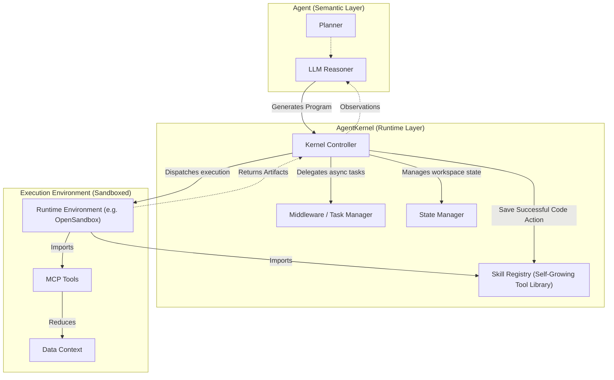

# AgentKernel


[](https://opensource.org/licenses/MIT)
[](https://github.com/TJKlein/agentkernel/actions/workflows/tests.yml)
[](pyproject.toml)
[](https://www.python.org/downloads/)
[](Dockerfile)
[](https://github.com/psf/black)

**A minimal computational substrate for Model Context Protocol (MCP) agents — with a self-growing tool library.**

AgentKernel decouples the **execution runtime** from the agent's reasoning loop. It provides a stable, high-performance primitive for building durable agent systems that can read, write, and execute code safely.

By treating tools as importable libraries within a sandboxed environment (the **[Programmatic Tool Calling](https://www.anthropic.com/engineering/code-execution-with-mcp)** pattern), AgentKernel enables agents to reason over large datasets and perform complex multi-step tasks without the latency and context bloat of chat-based tool use.

What sets AgentKernel apart is its implementation of **[Code Actions as Tools](https://gradion-ai.github.io/agents-nanny/2025/12/16/code-actions-as-tools-evolving-tool-libraries-for-agents/)**: instead of treating agent-generated code as ephemeral — generated, executed, then discarded — AgentKernel recognizes that a working code action represents a *tested solution*. When saved in a discoverable format with a callable API, it becomes a tool that future code actions can import and compose. **The agent thus serves two roles: a domain-specific agent performing the task at hand, and a toolsmith evolving its own capabilities.**

---

## ⚡️ One-Command Start (Docker)

The fastest way to get started using Docker Compose. This automatically spins up the AgentKernel server with the default OpenSandbox execution backend.

```bash
git clone https://github.com/TJKlein/AgentKernel
cd AgentKernel
cp .env.example .env   # Add your API keys here
docker compose up
```

Alternatively, you can run other execution backends using Docker profiles:
```bash
docker compose --profile microsandbox up   # Full MicroVM isolation (privileged mode required)
docker compose --profile monty up          # Zero-dependency, in-process execution
```

---
## ⚡️ Quick Start

AgentKernel works with **three execution backends**. Pick whichever matches your setup — they all work the same way once running.

### Option A — OpenSandbox (Default, recommended)
*Requires: Docker + one install command*

```bash
# 1. Install
pip install agentkernel opensandbox opensandbox-server

# 2. Configure server (one-time)
opensandbox-server init-config ~/.sandbox.toml --example docker

# 3. Start the server (keep this terminal open, or run in background)
opensandbox-server start

# 4. Run an agent
export OPENAI_API_KEY=your-key-here
python examples/00_simple_api.py
```

> **If you see** `❌ OpenSandbox server not reachable` — make sure Docker is running and `opensandbox-server start` is active.

---

### Option B — Monty (Zero dependencies)
*Requires: nothing extra — pure Python, in-process*

```bash
# 1. Install
pip install agentkernel pydantic-monty

# 2. Set sandbox type
export SANDBOX_TYPE=monty   # or set sandbox_type: monty in config.yaml

# 3. Run an agent
export OPENAI_API_KEY=your-key-here
python examples/00_simple_api.py
```

> Best for: quick experiments, logic-heavy tasks, CI environments.

---

### Option C — Microsandbox (Full OS isolation)
*Requires: Rust toolchain + build from source*

```bash
# 1. Install AgentKernel with the microsandbox runtime
pip install "agentkernel[microsandbox]"

# 3. Set sandbox type
export SANDBOX_TYPE=microsandbox  # or set sandbox_type: microsandbox in config.yaml

# 4. Run an agent
export OPENAI_API_KEY=your-key-here
python examples/00_simple_api.py
```

> Best for: tasks needing full system packages (`apt`, compilers, databases).

---


## 1. Architecture

AgentKernel standardizes the interaction between the semantic agent (LLM) and the execution environment (Kernel).



## 2. Philosophy: A Pluggable Computational Substrate

Contemporary agent frameworks often conflate logic, planning, and execution into monolithic loops. AgentKernel posits a different approach: **the execution runtime should be decoupled and pluggable.**

> **Thesis**: The interesting complexity in agent systems lies not just in prompt engineering, but in the runtime ability to safely execute generated programs across diverse environments — and to **learn from them** by evolving a persistent tool library.

AgentKernel provides a unified API over three foundational execution paradigms:
1.  **Docker Containers** (via OpenSandbox) for standard workloads.
2.  **In-Process AST Evaluation** (via Monty) for sub-millisecond reasoning loops.
3.  **MicroVMs** (via Microsandbox) for total OS-level isolation.

By standardizing execution, AgentKernel handles the heavy lifting of state management, context limits, and tool persistence, letting developers focus on the agent's cognitive loop.

### Code Actions as Tools

AgentKernel implements the **Programmatic Tool Calling (PTC)** pattern described by [Anthropic](https://www.anthropic.com/engineering/code-execution-with-mcp) and [Cloudflare](https://blog.cloudflare.com/code-mode/), treating tools as importable libraries rather than HTTP endpoints.

Building on this, AgentKernel introduces **[Code Actions as Tools](https://gradion-ai.github.io/agents-nanny/2025/12/16/code-actions-as-tools-evolving-tool-libraries-for-agents/)**: code actions that successfully complete a task are automatically extracted, typed, and saved into a persistent registry. The agent discovers and reuses these evolved tools in future sessions. **The agent thus serves two roles: a problem solver, and a toolsmith evolving its own capabilities.**

## 3. Performance & Capabilities

AgentKernel is built for high-throughput, low-latency execution of agent-generated code across multiple environments.

| Capability | Specification | Comparison |
|------------|---------------|------------|
| **Cold Start** | **< 10ms** (Monty) or **~1s** (OpenSandbox) | vs 2-5s (AWS Lambda) |
| **Context** | **Infinite (RLM)** | vs 128k - 2M Tokens (LLM Limit) |
| **Isolation** | Configurable (AST / Docker / MicroVM) | Built-in via Execution Backends |
| **State** | Persistent workspace pushing | vs Ephemeral / Stateless |
| **Cost** | Self-hosted ($0) | vs Cloud metering |

> **Verify Performance Yourself**: You can run the included `benchmark_pooling.py` script to reproduce these numbers in your own environment:
> ```bash
> python examples/benchmark_pooling.py
> ```

### Pluggable Execution Backends

AgentKernel is backend-agnostic. You can hot-swap the execution engine in `config.yaml` to match your workload's security and performance requirements without changing a single line of agent code.

*   **OpenSandbox (Default)**: [Docker-based local sandbox](https://github.com/alibaba/OpenSandbox) by Alibaba.
    *   *Best for*: Standard workloads requiring familiar Docker environments. Runs any image (`python`, `node`, etc.) locally.
*   **Monty**: [High-performance secure Python AST interpreter](https://github.com/pydantic/monty).
    *   *Best for*: Pure logic, reasoning loops, and CI environments. Delivers **sub-millisecond cold starts** with zero external dependencies.
*   **Microsandbox**: Full Linux MicroVMs natively isolated via `chroot`/namespaces.
    *   *Best for*: Untrusted execution needing full system packages (compilers, databases, `apt`). Offers highest OS isolation.

### Key Features
*   **Model Context Protocol (MCP)**: Native support for MCP tools.
*   **Skill Evolution (Self-Growing Tool Library)**: Successfully executed code is saved as typed, callable modules that the agent can reuse in future sessions.
*   **Execution Replay & Time-Travel Debugging**: Seamlessly log and restore sandbox state to rewind and fork previous agent sessions.
*   **Streaming Execution**: Live, Server-Sent Events (SSE) streaming of long-running execution outputs.
*   **Recursive Language Models (RLM)**: Process infinite context limits by treating data as variables and recursively querying the LLM loop.
*   **Volume Mounting & State**: Persistent workspaces allow multi-turn reasoning with state preservation.
*   **Async Middleware**: "Fire-and-forget" background task execution.

## 4. Manual Installation (Advanced)

### 1. Zero-dependency setup (Monty only)
If you just want to run AgentKernel with no background servers:
```bash
pip install agentkernel pydantic-monty
```

### 2. Full setup with OpenSandbox (Default)
```bash
pip install agentkernel opensandbox opensandbox-server
opensandbox-server init-config ~/.sandbox.toml --example docker
opensandbox-server start
```

### 3. Untrusted workloads setup (Microsandbox)
For full OS isolation using MicroVMs:
```bash
pip install "agentkernel[microsandbox]"
```

### 4. Verify Setup
```bash
python verify_setup.py
```

## 5. Usage Example

```python
from agentkernel import create_agent

# Initialize the kernel
agent = create_agent()

# Execute a complex, multi-step task in a single turn
result = agent.execute_task("""
    import pandas as pd
    from tools.data_analysis import load_dataset
    
    # Load and process data locally in the sandbox
    df = load_dataset("large_file.csv")
    summary = df.describe()
    
    print(summary)
""")

print(result.output)
```

## 6. Skill Evolution (Self-Growing Tool Library)

AgentKernel implements the **[Code Actions as Tools](https://gradion-ai.github.io/agents-nanny/2025/12/16/code-actions-as-tools-evolving-tool-libraries-for-agents/)** pattern, enabling a **Self-Growing Tool Library** where the agent acts as both a problem solver and a toolsmith.

### How it works

1.  **Execute**: The agent generates code to solve a novel task and executes it in the sandbox.
2.  **Evaluate**: On success, a heuristic evaluates whether the code action is worth preserving (compilability, function structure, output quality).
3.  **Extract & Save**: The code is wrapped into a canonical skill module with a typed `run()` entry-point, docstring metadata, and source attribution — then saved to `skills/`.
4.  **Discover & Reuse**: In future sessions, the agent's prompt is automatically injected with a listing of available skills (including typed signatures). The LLM can then `from skills.my_tool import run` instead of rewriting the logic.

```
Turn 1 (novel task):
  Agent → generates code → executes → success ✓ → auto-saved as skills/fetch_weather.py

Turn 2 (related task):
  Agent prompt includes: "# Available skills: fetch_weather(city: str) -> dict"
  Agent → imports fetch_weather → composes with new logic → done in fewer tokens
```

This closed-loop creates an **accumulating advantage**: the more tasks the agent solves, the richer its tool library becomes, and the faster and cheaper future tasks execute.

**Backend Compatibility:** Skill Evolution is seamlessly integrated across all AgentKernel runtimes natively. Whether executing standard scripts in `microsandbox`, running containers via `OpenSandbox`, running high-performance AST evaluations via `MontyExecutor`, or processing infinite-context chunks through the `RecursiveAgent`, evolved skills are automatically saved, discovered, and shared between all backends.

> See [`examples/17_skill_evolution.py`](examples/17_skill_evolution.py) for an end-to-end demo.

## 7. Recursive Language Models (RLM)

AgentKernel supports **Recursive Language Models**, a powerful pattern for processing infinite context by treating it as a programmable variable.

*   **Recursive Querying**: The agent writes code to inspect, slice, and chunk this data, and recursively calls the LLM via `ask_llm()` to process each chunk.
*   **No Context Window Limits**: Process gigabytes of text by delegating the "reading" to a loop, only pulling relevant info into the agent's context.

See `examples/15_recursive_agent.py` for a complete example.

## 8. Execution Replay & Time-Travel Debugging

AgentKernel includes full support for **Time-Travel Debugging**, enabling developers to seamlessly log, rewind, and fork agent sessions.

### How it works

1.  **Automatic Logging**: When enabled, `AgentHelper` automatically logs every execution step (task, logic, generated code, output, and success status) into a persistent JSONL session file in `workspace/.replay/`.
2.  **State Fast-Forwarding**: If an agent takes a wrong turn or you want to experiment with a different prompt, you can restore the sandbox state to any previous step using `agent.resume_from(session_id, step)`.
3.  **CLI Playback**: The included `replay.py` CLI allows you to view past sessions and step through them frame-by-frame.

```bash
python replay.py list                 # View all past sessions
python replay.py <session-id> <step>  # View a specific session up to a step
```

> See [`examples/19_replay.py`](examples/19_replay.py) for a complete time-travel demonstration.

## 9. Streaming Execution Output

For long-running tasks, waiting for the final output can break the illusion of an active agent. AgentKernel supports yielding execution outputs line-by-line via Server-Sent Events (SSE).

*   **`StreamingExecutor`**: A wrapper that intercepts executor stdout and yields real-time chunks.
*   **SSE API**: Exposed via `POST /execute/stream` on the AgentKernel HTTP server.

> See [`examples/18_streaming.py`](examples/18_streaming.py) for a client-side streaming demo.

## 10. Development and Testing

See **[CONTRIBUTING.md](CONTRIBUTING.md)** for setup and contribution guidelines.

```bash
make install-dev    # Install with dev deps
make env            # Copy .env.example → .env (add your API keys)
make test           # Unit + integration (no API key needed)
make test-e2e       # E2E with real LLM (requires .env)
make test-all       # Full suite
```

Without Make: `pytest tests/ -v -m "not live"` for unit+integration; `pytest tests/e2e/ -v` for live E2E (requires `.env`).

## 11. References & Inspiration

AgentKernel stands on the shoulders of giants.

*   **[Code Actions as Tools: Evolving Tool Libraries for Agents](https://gradion-ai.github.io/agents-nanny/2025/12/16/code-actions-as-tools-evolving-tool-libraries-for-agents/)** — The conceptual foundation for the Skill Evolution / Self-Growing Tool Library feature. Introduces the idea that working code actions should be saved as typed, discoverable tools rather than discarded after execution.
*   **[Anthropic: Code Execution with MCP](https://www.anthropic.com/engineering/code-execution-with-mcp)** — The Programmatic Tool Calling pattern: tools as importable code, not JSON schemas.
*   **[Cloudflare: Code Mode](https://blog.cloudflare.com/code-mode/)** — Production-scale implementation of code-based tool calling.
*   **[Recursive Language Models](https://arxiv.org/abs/2512.24601)** — Research into infinite context processing via recursive querying.
*   **[Microsandbox](https://github.com/TJKlein/microsandbox)** — The robust MicroVM runtime for secure code execution.
*   **[Monty](https://github.com/pydantic/monty)** — High-performance, sandboxed Python interpreter.
*   **[OpenSandbox](https://github.com/alibaba/OpenSandbox)** — Docker/Kubernetes-based local sandbox platform by Alibaba.

## Supporting the Project

If you find AgentKernel useful, consider starring the repository on GitHub. Stars help others discover the project and signal interest to the maintainers.

## License

MIT &copy; 2026 AgentKernel Team. Developed with the support of the **[Mantix](https://mantix.cloud)** AI Team.
