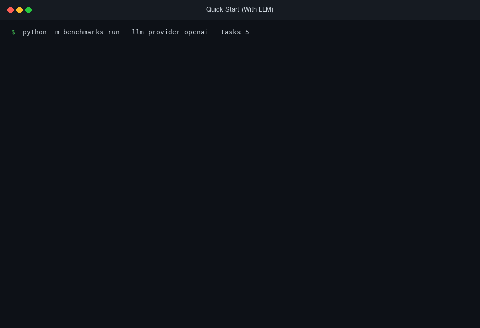
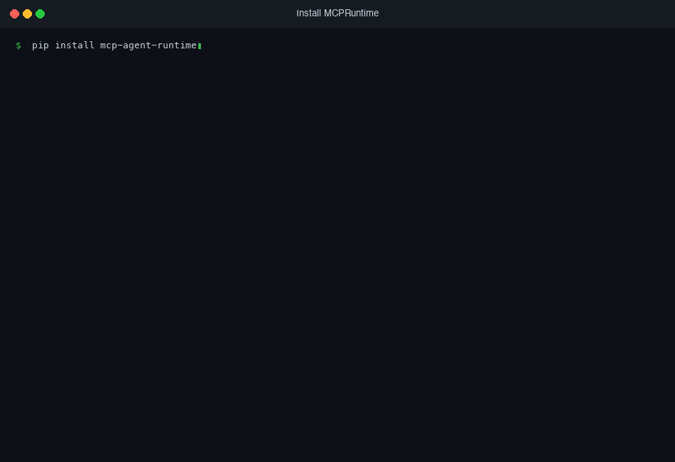
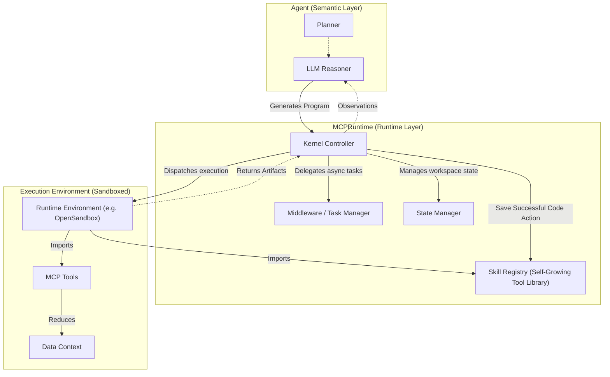
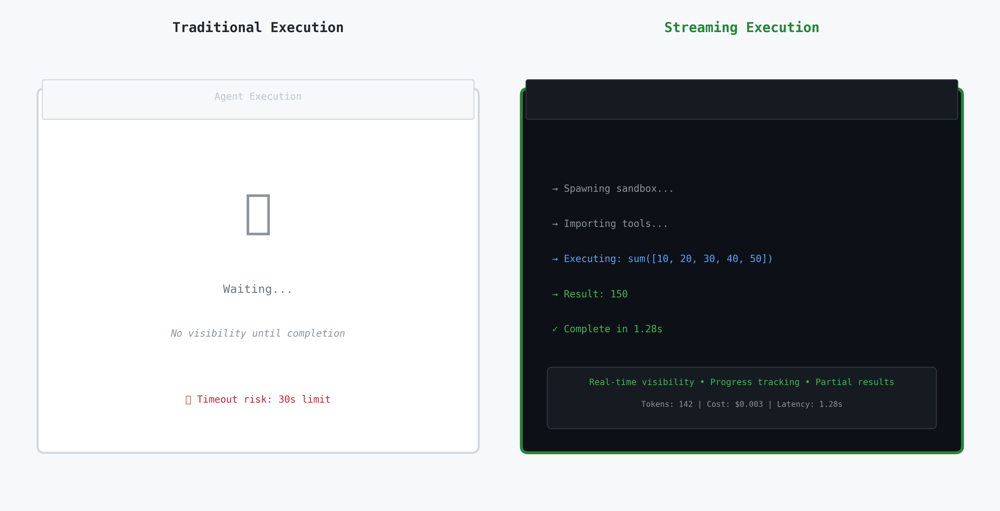

# MCPRuntime


[](https://opensource.org/licenses/MIT)
[](https://github.com/TJKlein/mcpruntime/actions/workflows/tests.yml)
[](pyproject.toml)
[](https://www.python.org/downloads/)
[](Dockerfile)
[](https://github.com/psf/black)
[](docs/benchmark_guide.md#citation)

Enterprise agents don't fail because LLMs are too weak. They fail because agents execute against systems they don't understand — and when they're wrong, there's no audit trail and no way to get better.

MCPRuntime is a minimal execution kernel for agents that need to earn their autonomy. It provides sandboxed code execution via MCP, a pluggable context layer that grounds agent actions in structured knowledge, and a skill registry that accumulates working solutions over time.

By treating tools as importable libraries within a sandboxed environment (the **[Programmatic Tool Calling](https://www.anthropic.com/engineering/code-execution-with-mcp)** pattern), MCPRuntime enables agents to reason over large datasets and perform complex multi-step tasks without the latency and context bloat of chat-based tool use.

What sets MCPRuntime apart is its implementation of **[Code Actions as Tools](https://gradion-ai.github.io/agents-nanny/2025/12/16/code-actions-as-tools-evolving-tool-libraries-for-agents/)**: instead of treating agent-generated code as ephemeral — generated, executed, then discarded — MCPRuntime recognizes that a working code action represents a *tested solution*. When saved in a discoverable format with a callable API, it becomes a tool that future code actions can import and compose. **The agent thus serves two roles: a domain-specific agent performing the task at hand, and a toolsmith evolving its own capabilities.**

## ⚡️ One-Command Start (Docker)

The fastest way to get started using Docker Compose. This automatically spins up the MCPRuntime server with the OpenSandbox execution backend.

```bash
git clone https://github.com/TJKlein/MCPRuntime
cd MCPRuntime
cp .env.example .env   # Add your API keys here
docker compose up
```


---
## ⚡️ Quick Start


*Run an agent in 60 seconds — no API key required*

MCPRuntime uses **OpenSandbox** as its execution backend, which runs code in Docker containers. OpenSandbox provides reliable sandboxing with full PTC (Programmatic Tool Calling) and **RLM (Recursive Language Model)** support—context data and the `ask_llm` callback are injected so infinite-context tasks work in the sandbox.

### Installation — OpenSandbox
*Requires: Docker + one install command*



```bash
# 1. Install
pip install mcp-agent-runtime opensandbox opensandbox-server

# 2. Configure server (one-time)
opensandbox-server init-config ~/.sandbox.toml --example docker

# 3. Start the server (keep this terminal open, or run in background)
opensandbox-server start

# 4. Run an agent
export OPENAI_API_KEY=your-key-here
python examples/00_simple_api.py
```

> **If you see** `❌ OpenSandbox server not reachable` — make sure Docker is running and `opensandbox-server start` is active.

---

## 1. Architecture

MCPRuntime standardizes the interaction between the semantic agent (LLM) and the execution environment (Kernel).



## 2. Philosophy: Autonomy Must Be Earned

Contemporary agent frameworks often conflate logic, planning, and execution into monolithic loops. MCPRuntime posits a different approach: **the execution runtime should be decoupled, and autonomy should be earned through demonstrated competence.**

> **Thesis**: The interesting complexity in agent systems lies not just in prompt engineering, but in the runtime ability to safely execute generated programs — and to **learn from them** by evolving a persistent tool library that improves with each execution.

MCPRuntime provides Docker-based isolation via OpenSandbox as the foundation for production workloads, with subprocess execution available for development. This is a deliberate architectural choice: Docker-based isolation is the minimum acceptable trust boundary for enterprise execution.

### Code Actions as Tools

MCPRuntime implements the **Programmatic Tool Calling (PTC)** pattern described by [Anthropic](https://www.anthropic.com/engineering/code-execution-with-mcp) and [Cloudflare](https://blog.cloudflare.com/code-mode/), treating tools as importable libraries rather than HTTP endpoints.

Building on this, MCPRuntime introduces **[Code Actions as Tools](https://gradion-ai.github.io/agents-nanny/2025/12/16/code-actions-as-tools-evolving-tool-libraries-for-agents/)**: code actions that successfully complete a task are automatically extracted, typed, and saved into a persistent registry. The agent discovers and reuses these evolved tools in future sessions. **The agent thus serves two roles: a problem solver, and a toolsmith evolving its own capabilities.**

## 3. Performance & Capabilities

MCPRuntime is built for high-throughput, low-latency execution of agent-generated code across multiple environments.

| Capability | Specification | Comparison |
|------------|---------------|------------|
| **Cold Start** | **~1s** (OpenSandbox) | vs 2-5s (AWS Lambda) |
| **Context** | **Unbounded via RLM** | vs 128k - 2M Tokens (LLM Limit) |
| **Isolation** | Docker containers (via OpenSandbox) | Built-in via Execution Backend |
| **State** | Persistent workspace pushing | vs Ephemeral / Stateless |
| **Cost** | Self-hosted ($0) | vs Cloud metering |

> **Verify Performance Yourself**: You can run the included `benchmark_pooling.py` script to reproduce these numbers in your own environment:
> ```bash
> python scripts/benchmark_pooling.py
> ```

### Execution Backend

MCPRuntime uses **OpenSandbox** as its execution backend, providing Docker container isolation for all agent workloads.

*   **OpenSandbox**: [Docker-based local sandbox](https://github.com/alibaba/OpenSandbox) by Alibaba.
    *   *Best for*: Standard workloads requiring familiar Docker environments. Runs any image (`python`, `node`, etc.) locally with full PTC (Programmatic Tool Calling) support.

### Key Features
*   **Model Context Protocol (MCP)**: Native support for MCP tools.
*   **Skill Evolution (Self-Growing Tool Library)**: Successfully executed code is saved as typed, callable modules that the agent can reuse in future sessions.
*   **Execution Replay & Time-Travel Debugging**: Seamlessly log and restore sandbox state to rewind and fork previous agent sessions.
*   **Streaming Execution**: Live, Server-Sent Events (SSE) streaming of long-running execution outputs.
*   **Recursive Language Models (RLM)**: Process unbounded context by treating data as variables and recursively querying the LLM loop.
*   **Volume Mounting & State**: Persistent workspaces allow multi-turn reasoning with state preservation.
*   **Async Middleware**: "Fire-and-forget" background task execution.

## 4. Manual Installation (Advanced)

### 1. Docker setup (recommended)
Install MCPRuntime with Docker support:
```bash
pip install mcp-agent-runtime
```

### 2. Full setup with OpenSandbox
```bash
pip install mcp-agent-runtime opensandbox opensandbox-server
opensandbox-server init-config ~/.sandbox.toml --example docker
opensandbox-server start
```

### 3. Verify Setup
```bash
python scripts/verify_setup.py
```

## 5. Usage Examples

Because MCPRuntime decouples execution from reasoning, it excels at two distinct paradigms: **Sandboxed Data Processing** and **Programmatic Tool Calling (PTC)**.

### Example A: Sandboxed Data Processing
The agent receives a natural-language goal, generates a Python program, and MCPRuntime executes it inside the sandbox. Data is processed locally — never exfiltrated back to the LLM.

```python
from mcpruntime import create_agent

agent = create_agent()

# 1. User provides a natural-language goal.
# 2. The coding agent generates the program below.
# 3. MCPRuntime executes it inside the sandbox.
result, output, error = agent.execute_task(
    "Analyse sales_data.csv and print a statistical summary."
)
# ↓ Agent-generated code running in the sandbox:
#   import pandas as pd
#   df = pd.read_csv('sales_data.csv')
#   print(df.describe())

print(output)
```

### Example B: Programmatic Tool Calling (PTC)
PTC is the same code-generation loop, but the agent-written program *calls enterprise tools as importable Python libraries* rather than issuing raw HTTP requests. MCPRuntime handles all authorization, retries, and observability transparently — the agent never touches credentials.

```python
from mcpruntime import create_agent

agent = create_agent()

# 1. User provides a natural-language goal.
# 2. The coding agent generates the program below.
# 3. MCPRuntime executes it inside the sandbox (auth is resolved by the runtime).
result, output, error = agent.execute_task(
    "Find all high-priority production bugs in CORE, "
    "open a hotfix branch for each, and ping the on-call channel."
)
# ↓ Agent-generated code running in the sandbox:
#   from tools.jira import search_issues, transition_issue
#   from tools.github import create_hotfix_branch
#   from tools.slack import notify_oncall
#
#   bugs = search_issues('project=CORE AND priority=High AND status=Open')
#   for bug in bugs:
#       if 'production' in bug.labels:
#           branch = create_hotfix_branch(f'fix/{bug.key}')
#           transition_issue(bug.key, 'IN_PROGRESS')
#           notify_oncall(f'Action on {bug.key}: branch {branch} created.')

print(output)
```

## 6. Skill Evolution (Self-Growing Tool Library)

MCPRuntime implements the **[Code Actions as Tools](https://gradion-ai.github.io/agents-nanny/2025/12/16/code-actions-as-tools-evolving-tool-libraries-for-agents/)** pattern, enabling a **Self-Growing Tool Library** where the agent acts as both a problem solver and a toolsmith.

### How it works

1.  **Execute**: The agent generates code to solve a novel task and executes it in the sandbox.
2.  **Evaluate**: On success, a heuristic evaluates whether the code action is worth preserving (compilability, function structure, output quality).
3.  **Extract & Save**: The code is wrapped into a canonical skill module with a typed `run()` entry-point, docstring metadata, and source attribution — then saved to `skills/`.
4.  **Discover & Reuse**: In future sessions, the agent's prompt is automatically injected with a listing of available skills (including typed signatures). The LLM can then `from skills.my_tool import run` instead of rewriting the logic.

```
Turn 1 (novel task):
  Agent → generates code → executes → success ✓ → auto-saved as skills/fetch_weather.py

Turn 2 (related task):
  Agent prompt includes: "# Available skills: fetch_weather(city: str) -> dict"
  Agent → imports fetch_weather → composes with new logic → done in fewer tokens
```

This closed-loop creates an **accumulating advantage**: the more tasks the agent solves, the richer its tool library becomes, and the faster and cheaper future tasks execute.

**Backend Compatibility:** Skill Evolution works across all MCPRuntime runtimes. Skills are automatically saved, discovered, and shared whether running containers via OpenSandbox or processing infinite-context chunks through the Recursive Language Model.

> See [`examples/17_skill_evolution.py`](examples/17_skill_evolution.py) for an end-to-end demo showing `AgentHelper` + `SkillManager` setup.

## 7. Recursive Language Models (RLM)

MCPRuntime supports **Recursive Language Models**, a powerful pattern for processing unbounded context by treating it as a programmable variable.

*   **Recursive Querying**: The agent writes code to inspect, slice, and chunk large datasets, then recursively calls the LLM via `ask_llm()` to process each chunk. The runtime injects `ask_llm` (and `CONTEXT_DATA` when applicable) into the sandbox so the generated code can call it without importing.
*   **Unbounded Context**: Process gigabytes of text by delegating the "reading" to a loop, only pulling relevant info into the agent's context.

**Example pattern:**
```python
# Agent task: "Go through every ticket in the backlog. Escalate to engineering 
# any where the user is frustrated by the login UI change."

# ↓ Agent-generated code running in the sandbox:
#   from tools.zendesk import get_all_tickets, escalate_ticket
#
#   for ticket in get_all_tickets():          # may be thousands of tickets
#       verdict = ask_llm(                    # ← LLM called recursively
#           f'Is this user frustrated? {ticket.text}'
#       )
#       if 'yes' in verdict.lower():
#           escalate_ticket(ticket.id, team='engineering')
```

RLM uses the `RecursiveAgent` class which handles chunking and recursive LLM calls automatically.

> See [`examples/15_recursive_agent.py`](examples/15_recursive_agent.py) for complete setup with `RecursiveAgent`, `FilesystemHelper`, and `OpenSandboxExecutor`.

## 8. Execution Replay & Time-Travel Debugging

MCPRuntime includes full support for **Time-Travel Debugging**, enabling developers to seamlessly log, rewind, and fork agent sessions.

### How it works

1.  **Automatic Logging**: When enabled, `AgentHelper` automatically logs every execution step (task, logic, generated code, output, and success status) into a persistent JSONL session file in `workspace/.replay/`.
2.  **State Fast-Forwarding**: If an agent takes a wrong turn or you want to experiment with a different prompt, you can restore the sandbox state to any previous step using `agent.resume_from(session_id, step)`.
3.  **CLI Playback**: The included `replay.py` CLI allows you to view past sessions and step through them frame-by-frame.

```bash
python scripts/replay.py list                 # View all past sessions
python scripts/replay.py <session-id> <step>  # View a specific session up to a step
```

> See [`examples/19_replay.py`](examples/19_replay.py) for a complete time-travel demonstration.

## 9. Streaming Execution Output

For long-running tasks, waiting for the final output can break the illusion of an active agent. MCPRuntime supports yielding execution outputs line-by-line via Server-Sent Events (SSE).


*Real-time streaming vs traditional blocking execution*

*   **`StreamingExecutor`**: A wrapper that intercepts executor stdout and yields real-time chunks.
*   **SSE API**: Exposed via `POST /execute/stream` on the MCPRuntime HTTP server.

```python
# Stream execution output in real-time
for event in agent.stream_execute(task):
    if event.type == "code_generated":
        print(f"📝 Generated: {event.code}")
    elif event.type == "output":
        print(f"📤 Output: {event.text}")
    elif event.type == "complete":
        print(f"✅ Complete in {event.time}s")
```

> See [`examples/18_streaming.py`](examples/18_streaming.py) for a client-side streaming demo.

## 10. MCPRuntime Benchmark Suite (MRBS)

The **MCPRuntime Benchmark Suite (MRBS)** is a benchmark for evaluating **agent execution runtimes**. Unlike traditional benchmarks that test pre-written code, MRBS tests the complete agent loop: LLM generates code from natural language tasks, the runtime executes it, and validators check correctness.

This provides actionable insights: *How well does OpenSandbox support my agent workload?*

### What MRBS Measures

| Metric | Why It Matters |
|--------|---------------|
| **Agent Success Rate** | % of tasks where LLM-generated code passes validation |
| **Time-to-Success (TTS)** | Total latency from prompt to working output |
| **Iterations Needed** | How many retries for agent to succeed |
| **Category Breakdown** | Per-category success rates reveal workload characteristics |

### Task Taxonomy

All tasks run **with or without** `--recursive`. Some tasks **favor RLM** (optional context + `ask_llm` when recursive).

*   **Programmatic Tool Calling (PTC)** (60): True PTC tasks requiring tool imports (calculator, weather, filesystem, database, HTTP, text, email, calendar, math, transforms, chained workflows)

### Running MRBS

MRBS has **evaluation modes** and an optional **RLM (recursive)** mode:

**1. LLM Mode (Realistic Agent Evaluation)**
```bash
# LLM generates code from natural language prompts
python -m benchmarks run --backend opensandbox --llm-provider azure_openai

# With --recursive: tasks that favor RLM get CONTEXT_DATA + ask_llm; others unchanged
python -m benchmarks run --backend opensandbox --llm-provider azure_openai --recursive
# Without --recursive: same tasks run with CONTEXT_DATA only (no ask_llm)

# Results: ~70-90% pass rate (realistic - LLMs make mistakes!)
```

**2. Baseline Mode (Infrastructure Verification)**
```bash
# Runs hand-written reference code (no LLM). Tasks with context get CONTEXT_DATA injected.
python -m benchmarks run --backend opensandbox --llm-provider none

# Results: ~75-80% pass rate on PTC easy tasks (expected with LLM)
```

**Backend:**
- **OpenSandbox** (Docker via server): ~75-80% pass rate on PTC easy tasks, ~3s per task. Full PTC support.

> See **[MRBS Guide](docs/benchmark_guide.md)** for statistical rigor, reporting guidelines, and detailed taxonomy.

## 11. Development and Testing

See **[CONTRIBUTING.md](CONTRIBUTING.md)** for setup and contribution guidelines.

```bash
make install-dev    # Install with dev deps
make env            # Copy .env.example → .env (add your API keys)
make test           # Unit + integration (no API key needed)
make test-e2e       # E2E with real LLM (requires .env)
make test-all       # Full suite
```

Without Make: `python -m pytest tests/ -v -m "not live"` for unit+integration; `python -m pytest tests/e2e/ -v` for live E2E (requires `.env`).

## 12. References & Inspiration

MCPRuntime stands on the shoulders of giants.

*   **[Code Actions as Tools: Evolving Tool Libraries for Agents](https://gradion-ai.github.io/agents-nanny/2025/12/16/code-actions-as-tools-evolving-tool-libraries-for-agents/)** — The conceptual foundation for the Skill Evolution / Self-Growing Tool Library feature. Introduces the idea that working code actions should be saved as typed, discoverable tools rather than discarded after execution.
*   **[Anthropic: Code Execution with MCP](https://www.anthropic.com/engineering/code-execution-with-mcp)** — The Programmatic Tool Calling pattern: tools as importable code, not JSON schemas.
*   **[Cloudflare: Code Mode](https://blog.cloudflare.com/code-mode/)** — Production-scale implementation of code-based tool calling.
*   **[Recursive Language Models](https://arxiv.org/abs/2512.24601)** — Research into infinite context processing via recursive querying.
*   **[OpenSandbox](https://github.com/alibaba/OpenSandbox)** — Docker/Kubernetes-based local sandbox platform by Alibaba.

## Supporting the Project

If you find MCPRuntime useful, please consider starring the repository on GitHub. Stars help others discover the project and signal interest to the maintainers.

### Citation

If you use MCPRuntime in your research, please cite:

```bibtex
@software{mcpruntime2025,
  title = {MCPRuntime: A Minimal Execution Kernel for Skill-Evolving Agents},
  author = {Klein, Tassilo and Mantix AI Research},
  year = {2025},
  url = {https://github.com/TJKlein/mcpruntime}
}
```

## License

MIT &copy; 2026 MCPRuntime Team.

*MCPRuntime's architectural approach was inspired by research from Mantix AI Research ([mantix.cloud](https://mantix.cloud)).*

*Please note: MCPRuntime relies on third-party open-source components such as OpenSandbox, which are licensed under the Apache License 2.0. See the `NOTICE` and `LICENSE` files for full details and attribution.*
